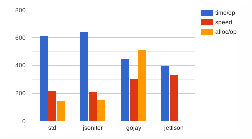
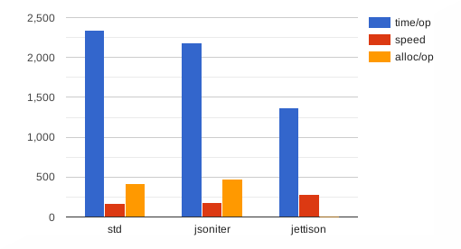

<h1 align="center">Jettison</h1>
<p align="center"></p><p align="center">Jettison is an instructions-based <strong>JSON</strong> encoder inspired by <a href="https://github.com/bet365/jingo">bet365/jingo</a>, with a richer features set, aiming at 100% compatibility with the standard library.</p>
<p align="center"><br><a href="https://godoc.org/github.com/wI2L/jettison"></a> <a href="https://goreportcard.com/report/wI2L/jettison"></a> <a href="https://travis-ci.org/wI2L/jettison"></a> <a href="https://codecov.io/gh/wI2L/jettison"></a> <a href="LICENSE"></a>
<br>
</p>

---

### Installation

```sh
$ go get -u github.com/wI2L/jettison
```

### Key points

- Fast, see [benchmarks](#benchmarks)
- Zero allocations on average
- Behavior *almost* identical to the standard library, by default
- No code generation required
- Options available to configure the Encoder
- Native support for `time.Time` and `time.Duration`

### Overview

The goal of Jettision is to take up the idea introduced by the **bet365/jingo** package and build a fully-featured JSON encoder around it, that comply with the behavior of the [encoding/json](https://golang.org/pkg/encoding/json/) package. Unlike the latter, Jettison does not use reflection during marshaling, but only once to create the instructions set for a given type ahead of time. The drawback to this approach requires to instantiate a separate encoder for each of the types that needs to be marshaled.

The package aims to have a behavior similar to that of the standard library for all types encoding and struct tags, meaning that the documentation of the `Marshal` [function](https://golang.org/pkg/encoding/json/#Marshal) is applicable for Jettison, with a few exceptions described in this [section](#differences-with-encodingjson). As such, most of the tests compare their output against it to guarantee that.

### Usage

First, create a new encoder for the type that needs to be marshaled, and compile the instructions set.
```go
import "github.com/wI2L/jettison"

type x struct {
    A string `json:"a,omitempty"`
    B int    `json:"b"`
}
enc, err := jettison.NewEncoder(x{})
if err != nil {
    // handle error
}
err = enc.Compile()
if err != nil {
    // handle error
}
```
Note that if you don't invoke the `Compile` method manually, the instructions will be generated once, on the first call to the `Encode` method.
```go
xx := x{
    A: "Loreum",
    B: 42,
}
var buf bytes.Buffer
if err := enc.Encode(&xx, &buf); err != nil {
    // handle error
}
fmt.Println(buf.String())
// {"a":"Loreum","b":42}
```
The second parameter of the `Encode` method is an interface that groups the `io.Writer`, `io.StringWriter` and `io.ByteWriter` interfaces. In the above example, we use a new `bytes.Buffer` instance, which implements the three interfaces mentioned.

### Options

Opt-in options are available to customize the behavior of the package. The third parameter of the `Encode` method is variadic and accept a list of functional options described below.

| Option | Description |
| ---: | --- |
| `TimeLayout` | Defines the layout used to encode `time.Time` values. `time.RFC3339Nano` is the default. |
| `DurationFormat` | Defines the format used to encode `time.Duration` values. `DurationString` is the default. See `DurationFmt` for the complete list of formats available. |
| `UnixTimestamp` | Encode `time.Time` values as JSON numbers representing Unix timestamps. |
| `UnsortedMap` | Disables map keys sort. |
| `ByteArrayAsString` | Encodes byte arrays as JSON strings rather than JSON arrays. The output is subject to the same escaping rules used for the `string` type, unless the option `NoStringEscaping` is also specified. |
| `RawByteSlices` | Disables *base64* default encoding used for byte slices. |
| `NilMapEmpty` | Encodes nil maps as empty JSON objects rather than `null`. |
| `NilSliceEmpty` | Encodes nil slices as empty JSON arrays rather than `null`. |
| `NoStringEscaping` | Disables strings escaping. |

### Differences with `encoding/json`

- Strings are not coerced to valid UTF-8 by replacing invalid bytes with the Unicode replacement rune, and the brackets `<` and `>` or ampersand `&` are not escaped. Escaping is only applied to bytes lower than `0x20` and those described in the JSON [spec](https://www.json.org/img/string.png).

- `time.Time` and `Time.Duration` types are handled natively by the package. For the first, the encoder doesn't invoke the `MarshalJSON`/`MarshalText` methods, but use `time.AppendFormat` directly. For the second, it isn't necessary to implements the `json.Marshaler` or `encoding.TextMarshaler` interfaces, the encoder uses the result of the methods `Minutes`, `Seconds`, `Nanoseconds` or `String` based on the duration format configured.

- Nil map keys instances implementing the `TextMarshaler` interface are encoded as an empty string, while the `encoding/package` currently panic because of that. See this [issue](https://github.com/golang/go/issues/33675) for more details.

- No support for `json.Number` at the moment. Will be added in a later release.

### Benchmarks

> Ubuntu 16.04.6 LTS, Intel(R) Core(TM) i5-6600 CPU @ 3.30GHz   
go version go1.12.5 linux/amd64

##### Simple

Basic object with fields of type `string`, `int` and `bool`. [source](https://github.com/wI2L/jettison/blob/master/encoder_test.go#L1206)



<details><summary>Stats</summary><br><pre>
name                      time/op
SimplePayload/standard-4    615ns ± 1%
SimplePayload/jsoniter-4    645ns ± 1%
SimplePayload/gojay-4       444ns ± 4%
SimplePayload/jettison-4    400ns ± 1%
-
name                      speed
SimplePayload/standard-4  219MB/s ± 1%
SimplePayload/jsoniter-4  209MB/s ± 1%
SimplePayload/gojay-4     304MB/s ± 4%
SimplePayload/jettison-4  337MB/s ± 1%
-
name                      alloc/op
SimplePayload/standard-4     144B ± 0%
SimplePayload/jsoniter-4     152B ± 0%
SimplePayload/gojay-4        512B ± 0%
SimplePayload/jettison-4    0.00B
-
name                      allocs/op
SimplePayload/standard-4     1.00 ± 0%
SimplePayload/jsoniter-4     2.00 ± 0%
SimplePayload/gojay-4        1.00 ± 0%
SimplePayload/jettison-4     0.00
</pre></details>

##### Complex

Payload with a variety of composite Go types, such as `struct`, multi-dimensions `array`, and `slice`, with pointer and non-pointer value types. [source](https://github.com/wI2L/jettison/blob/master/encoder_test.go#L1299)



<details><summary>Stats</summary><br><pre>
name                       time/op
ComplexPayload/standard-4   2.34µs ± 0%
ComplexPayload/jsoniter-4   2.18µs ± 2%
ComplexPayload/jettison-4   1.37µs ± 1%
-
name                       speed
ComplexPayload/standard-4  165MB/s ± 0%
ComplexPayload/jsoniter-4  178MB/s ± 2%
ComplexPayload/jettison-4  283MB/s ± 1%
-
name                       alloc/op
ComplexPayload/standard-4     416B ± 0%
ComplexPayload/jsoniter-4     472B ± 0%
ComplexPayload/jettison-4    0.00B
-
name                       allocs/op
ComplexPayload/standard-4     1.00 ± 0%
ComplexPayload/jsoniter-4     3.00 ± 0%
ComplexPayload/jettison-4     0.00
</pre></details>

---

This package uses some portions of code of the Go **encoding/json** package.
The associated license can be found in [LICENSE.golang](LICENSE.golang).
