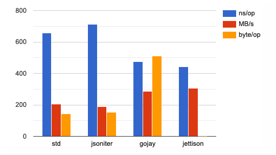
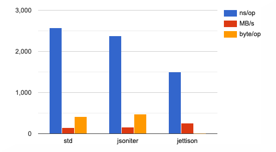
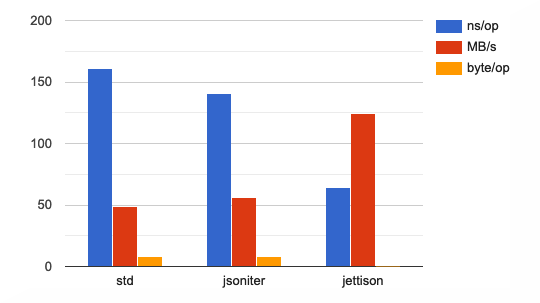
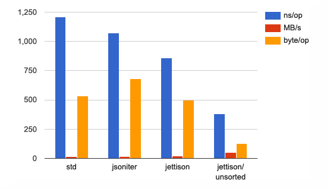

<h1 align="center">Jettison</h1>
<p align="center"></p><p align="center">Jettison is a high performance, reflection-less, and configurable <strong>JSON</strong> encoder for the Go programming language, inspired by <a href="https://github.com/bet365/jingo">bet365/jingo</a>, with a richer features set, aiming at 100% compatibility with the standard library.</p>
<p align="center">
    <a href="https://godoc.org/github.com/wI2L/jettison"></a>
    <a href="https://goreportcard.com/report/wI2L/jettison"></a>
    <a href="https://travis-ci.org/wI2L/jettison"></a>
    <a href="https://github.com/wI2L/jettison/actions"></a>
    <a href="https://codecov.io/gh/wI2L/jettison"></a>
    <a href="https://github.com/wI2L/jettison/releases"></a>
    <a href="LICENSE"></a>
<br>
</p>

---

## Installation

Jettison uses the new [Go modules](https://github.com/golang/go/wiki/Modules). Releases are tagged according to the _SemVer_ format, prefixed with a `v`, starting from *0.2.0*. You can get the latest release using the following command.

```sh
$ go get github.com/wI2L/jettison
```
:warning: Requires Go1.12+, due to the usage of the `io.StringWriter` interface.

## Key features

- Fast, see [benchmarks](#benchmarks)
- Efficient, zero allocations on average
- Behavior identical to the standard library by default
- No code generation required
- Clear and concise API
- Configurable with opt-in functional options
- Native support for `time.Time` and `time.Duration` types
- Custom `Marshaler` interface to work with a `Writer`
- Extensive testsuite that compares its output against `encoding/json`

## Overview

The goal of Jettision is to take up the idea introduced by the **bet365/jingo** package and build a fully-featured JSON encoder around it, that comply with the behavior of the [encoding/json](https://golang.org/pkg/encoding/json/) package. Unlike the latter, Jettison does not use reflection during marshaling, but only once to create the instruction set for a given type ahead of time. The drawback to this approach requires to instantiate an encoder once for each type that needs to be marshaled.

The package aims to have a behavior similar to that of the standard library for all types encoding and struct tags, meaning that the documentation of the `json.Marshal` [function](https://golang.org/pkg/encoding/json/#Marshal) is applicable for Jettison, with a few exceptions described in this [section](#differences-with-encodingjson). As such, most of the tests compare their output against it to guarantee that.

### Implementation details

The main concept of Jettison consists of using pre-build encoders to reduce the cost of using the `reflect` package at runtime. When a new instance of an encoder is created for a specific type, a set of _instructions_ is recursively generated, which defines how to iteratively encode a value. An _instruction_ is a function or a closure, that have all the information required to read the data from memory using _unsafe_ operations during the instruction set execution.

### Differences with `encoding/json`

All notable differences with the standard library behavior are listed below. Please bote that these might evolve with future versions of the package.

##### Limitations

- The JSON returned by the `MarshalJSON` method of types implementing the `json.Marshaler` interface is neither validated nor compacted.

##### Improvements

- The `time.Time` and `time.Duration` types are handled natively. For time values, the encoder doesn't invoke `MarshalJSON` or `MarshalText`, but use the `time.AppendFormat` [function](https://golang.org/pkg/time/#Time.AppendFormat) instead, and write the result to the stream. Similarly, for durations, it isn't necessary to implements the `json.Marshaler` or `encoding.TextMarshaler` interfaces on a custom wrapper type, the encoder uses the result of one of the methods `Minutes`, `Seconds`, `Nanoseconds` or `String`, based on the duration [format](https://godoc.org/github.com/wI2L/jettison#DurationFmt) configured.

##### Bugs

- Nil map keys values implementing the `encoding.TextMarshaler` interface are encoded as empty strings, while the `encoding/json` package currently panic because of that. See this [issue](https://github.com/golang/go/issues/33675) for more details.<sup>[1]</sup>

- Nil struct fields implementing the `encoding.TextMarshaler` interface are encoded as `null`, while the `encoding/json` package currently panic because of that. See this [issue](https://github.com/golang/go/issues/34235) for more details.<sup>[1]</sup>

<sup>1: The issues mentioned above have had their associated CL merged, and should be shipped with Go 1.14.</sup>

## Usage

### Basic

Starting from version *0.3.0*, the `Marshal` and `MarshalTo` functions are available. The first will allocate a new bytes slice to store the encoding of the given value, similar to `json.Marshal`, while the latter will write to the `Writer`. These functions use a package's cache to fetch the appropriate encoder for the given value type. If an encoder does not exist, a new one is created on the fly and stored in the cache for future reuse.

```go
type X struct {
   A string `json:"a"`
   B int64  `json:"b"`
}
b, err := jettison.Marshal(X{
   A: "Loreum",
   B: 42,
})
if err != nil {
   log.Fatal(err)
}
os.Stdout.Write(b)
```
Output
```json
{"a":"Loreum","b":42}
```

### Advanced

If more control over the encoding behavior is required, or to avoid the latency of creating a new encoder when encoding a type for the first time, an encoder can be created ahead of time, during initialization. Note that if you don't invoke the `Compile` method, the instruction set will be generated once, on the first call to the `Encode` method.

The second parameter of the `Encode` method is an interface that groups the `io.Writer`, `io.StringWriter` and `io.ByteWriter` interfaces. In the following example, we use a new `bytes.Buffer` instance, which implements the three interfaces previously mentioned.

```go
type X struct {
    A string `json:"a,omitempty"`
    B int    `json:"b"`
}
enc, err := jettison.NewEncoder(reflect.TypeOf(X{}))
if err != nil {
    log.Fatal(err)
}
err = enc.Compile()
if err != nil {
    log.Fatal(err)
}
xx := X{
    A: "Loreum",
    B: 42,
}
var buf bytes.Buffer
if err := enc.Encode(&xx, &buf); err != nil {
    log.Fatal(err)
}
os.Stdout.Write(b)
```
Output
```json
{"a":"Loreum","b":42}
```

### Options

Several opt-in [options](https://godoc.org/github.com/wI2L/jettison#Option) are available to customize the behavior of an encoder. The third parameter of the `Encode` method is variadic and accept a list of functional options described below.

- **TimeLayout**   
Defines the layout used to encode `time.Time` values. The layout must be compatible with the [AppendFormat](https://golang.org/pkg/time/#Time.AppendFormat) method. The default layout is `time.RFC3339Nano`.
- **DurationFormat**   
Defines the format used to encode `time.Duration` values. The default format is `DurationString`. See the documentation of the `DurationFmt` type for the complete list of formats available.
- **UnixTimestamp**   
Encode `time.Time` values as JSON numbers representing Unix timestamps, the number of seconds elapsed since Januaray 1, 1970 UTC. It uses the `time.Unix` method. This option has precedence over `TimeLayout`.
- **UnsortedMap**   
Disables map keys sort. See [Map](#map) benchmark for performance difference.
- **ByteArrayAsString**   
Encodes byte arrays as JSON strings rather than JSON arrays. The output is subject to the same escaping rules used for the `string` type, unless the option `NoStringEscaping` is also used.
- **RawByteSlice**   
Disables the *base64* default encoding used for byte slices.
- **NilMapEmpty**   
Encodes nil Go maps as empty JSON objects rather than `null`.
- **NilSliceEmpty**   
Encodes nil Go slices as empty JSON arrays rather than `null`.
- **NoStringEscaping**   
Disables string escaping. `NoHTMLEscaping` and `NoUTF8Coercion` are ignored when this option is used.
- **NoHTMLEscaping**   
Disables the escaping of special HTML characters such as `&`, `<` and `>` in JSON strings. This is similar to `json.Encoder.SetEscapeHTML(false)`.
- **NoUTF8Coercion**   
Disables the replacement of invalid bytes with the Unicode replacement rune in JSON strings.

## Benchmarks

> Ubuntu 16.04.6 LTS, Intel(R) Core(TM) i5-6600 CPU @ 3.30GHz   
> go version go1.13 linux/amd64   
> jettison *v0.3.0*

### Simple

Basic object with fields of type `string`, `int` and `bool`. [source](https://github.com/wI2L/jettison/blob/master/bench_test.go#L43)



<details><summary>Stats</summary><br><pre>
name                      time/op
SimplePayload/standard-4    658ns ± 2%
SimplePayload/jsoniter-4    711ns ± 1%
SimplePayload/gojay-4       474ns ± 1%
SimplePayload/jettison-4    441ns ± 0%
-
name                      speed
SimplePayload/standard-4  205MB/s ± 2%
SimplePayload/jsoniter-4  190MB/s ± 1%
SimplePayload/gojay-4     285MB/s ± 1%
SimplePayload/jettison-4  306MB/s ± 0%
-
name                      alloc/op
SimplePayload/standard-4     144B ± 0%
SimplePayload/jsoniter-4     152B ± 0%
SimplePayload/gojay-4        512B ± 0%
SimplePayload/jettison-4    0.00B
-
name                      allocs/op
SimplePayload/standard-4     1.00 ± 0%
SimplePayload/jsoniter-4     2.00 ± 0%
SimplePayload/gojay-4        1.00 ± 0%
SimplePayload/jettison-4     0.00
</pre></details>

### Complex

Payload with a variety of composite Go types, such as `struct`, multi-dimensions `array`, and `slice`, with pointer and non-pointer value types. [source](https://github.com/wI2L/jettison/blob/master/bench_test.go#L112)



<details><summary>Stats</summary><br><pre>
name                       time/op
ComplexPayload/standard-4   2.57µs ± 0%
ComplexPayload/jsoniter-4   2.38µs ± 1%
ComplexPayload/jettison-4   1.50µs ± 0%
-
name                       speed
ComplexPayload/standard-4  151MB/s ± 0%
ComplexPayload/jsoniter-4  163MB/s ± 1%
ComplexPayload/jettison-4  258MB/s ± 0%
-
name                       alloc/op
ComplexPayload/standard-4     416B ± 0%
ComplexPayload/jsoniter-4     472B ± 0%
ComplexPayload/jettison-4    0.00B
-
name                       allocs/op
ComplexPayload/standard-4     1.00 ± 0%
ComplexPayload/jsoniter-4     3.00 ± 0%
ComplexPayload/jettison-4     0.00
</pre></details>

### Interface



<details><summary>Stats</summary><br><pre>
name                  time/op
Interface/standard-4     161ns ± 4%
Interface/jsoniter-4     141ns ± 1%
Interface/jettison-4    64.7ns ± 3%
-
name                  speed
Interface/standard-4  49.7MB/s ± 4%
Interface/jsoniter-4  56.8MB/s ± 1%
Interface/jettison-4   124MB/s ± 3%
-
name                  alloc/op
Interface/standard-4     8.00B ± 0%
Interface/jsoniter-4     8.00B ± 0%
Interface/jettison-4     0.00B
-
name                  allocs/op
Interface/standard-4      1.00 ± 0%
Interface/jsoniter-4      1.00 ± 0%
Interface/jettison-4      0.00
</pre></details>

### Map

Compares Go map marshaling performances, with and without keys sort. [source](https://github.com/wI2L/jettison/blob/master/bench_test.go#L251)



<details><summary>Stats</summary><br><pre>
name                   time/op
Map/standard-4           1.21µs ± 5%
Map/jsoniter-4           1.07µs ± 1%
Map/jettison/sort-4       860ns ± 0%
Map/jettison/nosort-4     379ns ± 1%
-
name                   speed
Map/standard-4         15.8MB/s ± 4%
Map/jsoniter-4         17.7MB/s ± 1%
Map/jettison/sort-4    22.1MB/s ± 1%
Map/jettison/nosort-4  50.1MB/s ± 1%
-
name                   alloc/op
Map/standard-4             536B ± 0%
Map/jsoniter-4             680B ± 0%
Map/jettison/sort-4        496B ± 0%
Map/jettison/nosort-4      128B ± 0%
-
name                   allocs/op
Map/standard-4             13.0 ± 0%
Map/jsoniter-4             11.0 ± 0%
Map/jettison/sort-4        6.00 ± 0%
Map/jettison/nosort-4      2.00 ± 0%
</pre></details>

## License

Jettison is licensed under the **MIT** license. See the [LICENSE](LICENSE) file.

This package also uses some portions of code from the Go **encoding/json** package. The associated license can be found in [LICENSE.golang](LICENSE.golang).
