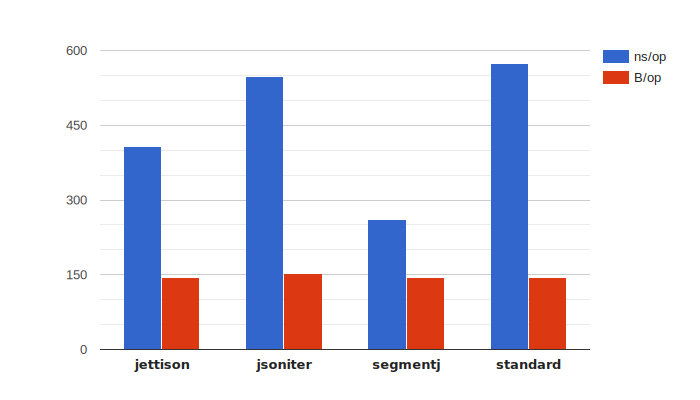
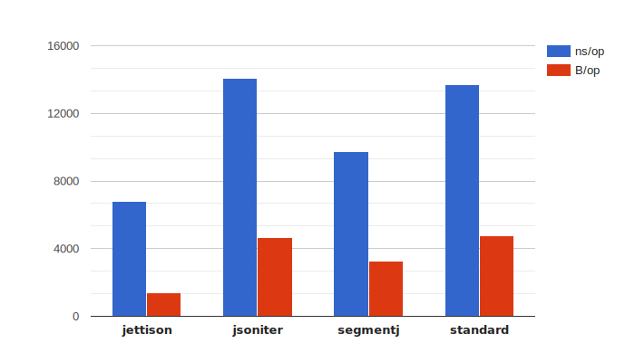
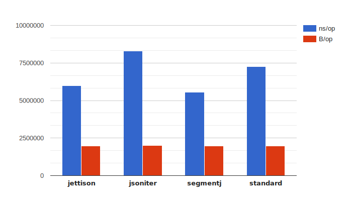
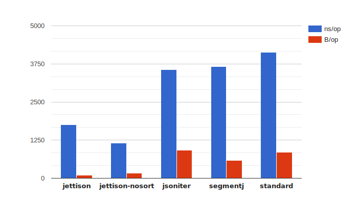

<h1 align="center">Jettison</h1>
<p align="center"></p><p align="center">Jettison is a fast and flexible <strong>JSON</strong> encoder for the Go programming language, inspired by <a href="https://github.com/bet365/jingo">bet365/jingo</a>, with a richer features set, aiming at <strong>100%</strong> compatibility with the standard library.</p>
<p align="center">
    <a href="https://pkg.go.dev/github.com/wI2L/jettison?tab=doc"></a>
    <a href="https://goreportcard.com/report/wI2L/jettison"></a>
    <a href="https://travis-ci.org/wI2L/jettison"></a>
    <a href="https://github.com/wI2L/jettison/actions"></a>
    <a href="https://codecov.io/gh/wI2L/jettison"></a>
    <a href="https://github.com/wI2L/jettison/releases"></a>
    <a href="LICENSE"></a>
    <a href="https://github.com/avelino/awesome-go"></a>
<br>
</p>

---

## Installation

Jettison uses [Go modules](https://github.com/golang/go/wiki/Modules). Releases are tagged according to the _SemVer_ format, prefixed with a `v`, starting from *0.2.0*. You can get the latest release using the following command.

```console
$ go get github.com/wI2L/jettison@latest
```

:warning: From version `v0.7.4`, the package requires [Go 1.17+](https://golang.org/doc/install) to build, due to the usage of the [new build constraints](https://go.googlesource.com/proposal/+/master/design/draft-gobuild.md).

## Key features

- Fast, see [benchmarks](#benchmarks)
- No dynamic memory allocations in hot paths
- Behavior identical to the standard library by default
- No code generation required
- Clear and concise API
- Configurable with opt-in functional options
- Native support for many standard library types, see [improvements](#improvements)
- Custom `AppendMarshaler` interface to avoid allocations
- Extensive testsuite that compares its output against `encoding/json`

## Overview

The goal of Jettision is to take up the idea introduced by the **bet365/jingo** package and build a fully-featured JSON encoder around it, that comply with the behavior of the [encoding/json](https://golang.org/pkg/encoding/json/) package. Unlike the latter, Jettison does not use reflection during marshaling, but only once to create the instruction set for a given type ahead of time. The drawback to this approach requires to instantiate an instruction-set once for each type that needs to be marshaled, but that is overcomed with a package cache.

The package aims to have a behavior similar to that of the standard library for all types encoding and struct tags, meaning that the documentation of the `json.Marshal` [function](https://golang.org/pkg/encoding/json/#Marshal) is applicable for Jettison, with a few exceptions described in this [section](#differences-with-encodingjson). As such, most of the tests compare their output against it to guarantee that.

### Implementation details

The main concept of Jettison consists of using pre-build instructions-set to reduce the cost of using the `reflect` package at runtime. When marshaling a value, a set of _instructions_ is recursively generated for its type, which defines how to iteratively encode it. An _instruction_ is a function or a closure, that have all the information required to read the data from memory using _unsafe_ operations (pointer type conversion, arithmetic...) during the instruction set execution.

### Differences with `encoding/json`

All notable differences with the standard library behavior are listed below. Please note that these might evolve with future versions of the package.

#### Improvements

- The `time.Time` and `time.Duration` types are handled natively. For time values, the encoder doesn't invoke `MarshalJSON` or `MarshalText`, but use the `time.AppendFormat` [function](https://golang.org/pkg/time/#Time.AppendFormat) instead, and write the result to the stream. Similarly, for durations, it isn't necessary to implements the `json.Marshaler` or `encoding.TextMarshaler` interfaces on a custom wrapper type, the encoder uses the result of one of the methods `Minutes`, `Seconds`, `Nanoseconds` or `String`, based on the duration [format](https://godoc.org/github.com/wI2L/jettison#DurationFmt) configured.

- The `sync.Map` type is handled natively. The marshaling behavior is similar to the one of a standard Go `map`. The option `UnsortedMap` can also be used in cunjunction with this type to disable the default keys sort.

- The `omitnil` field tag's option can be used to specify that a field with a nil pointer should be omitted from the encoding. This option has precedence over the `omitempty` option. Note that struct fields that implement the `json.Marshaler` interface will be omitted too, if they return the literal JSON `null` value.

#### Bugs

##### Go1.13 and backward

- Nil map keys values implementing the `encoding.TextMarshaler` interface are encoded as empty strings, while the `encoding/json` package currently panic because of that. See this [issue](https://github.com/golang/go/issues/33675) for more details.<sup>[1]</sup>

- Nil struct fields implementing the `encoding.TextMarshaler` interface are encoded as `null`, while the `encoding/json` package currently panic because of that. See this [issue](https://github.com/golang/go/issues/34235) for more details.<sup>[1]</sup>

<sup>1: The issues mentioned above have had their associated CL merged, and was released with Go 1.14.</sup>

## Usage

### Basic

As stated above, the library behave similarly to the `encoding/json` package. You can simply replace the `json.Marshal` function with `jettison.Marshal`, and expect the same output with better performances.

```go
type X struct {
   A string `json:"a"`
   B int64  `json:"b"`
}
b, err := jettison.Marshal(X{
   A: "Loreum",
   B: 42,
})
if err != nil {
   log.Fatal(err)
}
os.Stdout.Write(b)
```
###### Result
```json
{"a":"Loreum","b":42}
```

### Advanced

If more control over the encoding behavior is required, use the `MarshalOpts` function instead. The second parameter is variadic and accept a list of functional opt-in [options](https://godoc.org/github.com/wI2L/jettison#Option) described below:

|           name           | description                                                                                                                                                                        |
|:------------------------:| ---------------------------------------------------------------------------------------------------------------------------------------------------------------------------------- |
|     **`TimeLayout`**     | Defines the layout used to encode `time.Time` values. The layout must be compatible with the [AppendFormat](https://golang.org/pkg/time/#Time.AppendFormat) method.                |
|   **`DurationFormat`**   | Defines the format used to encode `time.Duration` values. See the documentation of the `DurationFmt` type for the complete list of formats available.                              |
|      **`UnixTime`**      | Encode `time.Time` values as JSON numbers representing Unix timestamps, the number of seconds elapsed since *January 1, 1970 UTC*. This option has precedence over `TimeLayout`.   |
|    **`UnsortedMap`**     | Disables map keys sort.                                                                                                                                                            |
| **`ByteArrayAsString`**  | Encodes byte arrays as JSON strings rather than JSON arrays. The output is subject to the same escaping rules used for JSON strings, unless the option `NoStringEscaping` is used. |
|    **`RawByteSlice`**    | Disables the *base64* default encoding used for byte slices.                                                                                                                       |
|    **`NilMapEmpty`**     | Encodes nil Go maps as empty JSON objects rather than `null`.                                                                                                                      |
|   **`NilSliceEmpty`**    | Encodes nil Go slices as empty JSON arrays rather than `null`.                                                                                                                     |
|  **`NoStringEscaping`**  | Disables string escaping. `NoHTMLEscaping` and `NoUTF8Coercion` are ignored when this option is used.                                                                              |
|   **`NoHTMLEscaping`**   | Disables the escaping of special HTML characters such as `&`, `<` and `>` in JSON strings. This is similar to `json.Encoder.SetEscapeHTML(false)`.                                 |
|   **`NoUTF8Coercion`**   | Disables the replacement of invalid bytes with the Unicode replacement rune in JSON strings.                                                                                       |
|     **`AllowList`**      | Sets a whitelist that represents which fields are to be encoded when marshaling a Go struct.                                                                                       |
|      **`DenyList`**      | Sets a blacklist that represents which fields are ignored during the marshaling of a Go struct.                                                                                    |
|     **`NoCompact`**      | Disables the compaction of JSON output produced by `MarshalJSON` method, and `json.RawMessage` values.                                                                             |
| **`NoNumberValidation`** | Disables the validation of `json.Number` values.                                                                                                                                   |
|    **`WithContext`**     | Sets the `context.Context` to be passed to invocations of `AppendJSONContext` methods.                                                                                             |

Take a look at the [examples](example_test.go) to see these options in action.

## Benchmarks

If you'd like to run the benchmarks yourself, use the following command.

```shell
go get github.com/cespare/prettybench
go test -bench=. | prettybench
```

### Results `-short`

These benchmarks were run 10x (statistics computed with [benchstat](https://godoc.org/golang.org/x/perf/cmd/benchstat)) on a MacBook Pro 15", with the following specs:
```
OS:  macOS Catalina (10.15.7)
CPU: 2.6 GHz Intel Core i7
Mem: 16GB
Go:  go version go1.17 darwin/amd64
Tag: v0.7.2
```

<details><summary>Stats</summary><br><pre>
name                    time/op
Simple/standard-8          573ns ± 1%
Simple/jsoniter-8          547ns ± 0%
Simple/segmentj-8          262ns ± 1%
Simple/jettison-8          408ns ± 1%
Complex/standard-8        11.7µs ± 0%
Complex/jsoniter-8        11.6µs ± 1%
Complex/segmentj-8        7.96µs ± 0%
Complex/jettison-8        5.90µs ± 1%
CodeMarshal/standard-8    6.71ms ± 0%
CodeMarshal/jsoniter-8    6.35ms ± 1%
CodeMarshal/segmentj-8    4.38ms ± 1%
CodeMarshal/jettison-8    5.56ms ± 1%
Map/standard-8            1.83µs ± 1%
Map/jsoniter-8            1.65µs ± 0%
Map/segmentj-8            1.61µs ± 0%
Map/jettison-8             772ns ± 1%
Map/jettison-nosort-8      507ns ± 1%

name                    speed
Simple/standard-8        236MB/s ± 1%
Simple/jsoniter-8        247MB/s ± 0%
Simple/segmentj-8        516MB/s ± 1%
Simple/jettison-8        331MB/s ± 1%
Complex/standard-8      72.9MB/s ± 0%
Complex/jsoniter-8      70.6MB/s ± 0%
Complex/segmentj-8       108MB/s ± 0%
Complex/jettison-8       144MB/s ± 1%
CodeMarshal/standard-8   289MB/s ± 0%
CodeMarshal/jsoniter-8   306MB/s ± 1%
CodeMarshal/segmentj-8   443MB/s ± 1%
CodeMarshal/jettison-8   349MB/s ± 1%
Map/standard-8          46.6MB/s ± 1%
Map/jsoniter-8          51.5MB/s ± 0%
Map/segmentj-8          52.8MB/s ± 0%
Map/jettison-8           110MB/s ± 1%
Map/jettison-nosort-8    168MB/s ± 1%

name                    alloc/op
Simple/standard-8           144B ± 0%
Simple/jsoniter-8           152B ± 0%
Simple/segmentj-8           144B ± 0%
Simple/jettison-8           144B ± 0%
Complex/standard-8        4.05kB ± 0%
Complex/jsoniter-8        3.95kB ± 0%
Complex/segmentj-8        2.56kB ± 0%
Complex/jettison-8          935B ± 0%
CodeMarshal/standard-8    1.97MB ± 0%
CodeMarshal/jsoniter-8    2.00MB ± 0%
CodeMarshal/segmentj-8    1.98MB ± 2%
CodeMarshal/jettison-8    1.98MB ± 2%
Map/standard-8              888B ± 0%
Map/jsoniter-8              884B ± 0%
Map/segmentj-8              576B ± 0%
Map/jettison-8             96.0B ± 0%
Map/jettison-nosort-8       160B ± 0%

name                    allocs/op
Simple/standard-8           1.00 ± 0%
Simple/jsoniter-8           2.00 ± 0%
Simple/segmentj-8           1.00 ± 0%
Simple/jettison-8           1.00 ± 0%
Complex/standard-8          79.0 ± 0%
Complex/jsoniter-8          71.0 ± 0%
Complex/segmentj-8          52.0 ± 0%
Complex/jettison-8          8.00 ± 0%
CodeMarshal/standard-8      1.00 ± 0%
CodeMarshal/jsoniter-8      2.00 ± 0%
CodeMarshal/segmentj-8      1.00 ± 0%
CodeMarshal/jettison-8      1.00 ± 0%
Map/standard-8              19.0 ± 0%
Map/jsoniter-8              14.0 ± 0%
Map/segmentj-8              18.0 ± 0%
Map/jettison-8              1.00 ± 0%
Map/jettison-nosort-8       2.00 ± 0%
</pre></details>

#### Simple [[source](https://github.com/wI2L/jettison/blob/master/bench_test.go#L50)]

Basic payload with fields of type `string`, `int` and `bool`.



#### Complex [[source](https://github.com/wI2L/jettison/blob/master/bench_test.go#L65)]

Large payload with a variety of composite Go types, such as `struct`, `map`, `interface`, multi-dimensions `array` and `slice`, with pointer and non-pointer value types.

Please note that this test is somewhat positively influenced by the performances of map marshaling.



#### CodeMarshal [[source](https://github.com/wI2L/jettison/blob/master/bench_test.go#L69)]

Borrowed from the `encoding/json` tests. See [testdata/code.json.gz](testdata/code.json.gz).



#### Map [[source](https://github.com/wI2L/jettison/blob/master/bench_test.go#L75)]

Simple `map[string]int` with 6 keys.



## Credits

This library and its design has been inspired by the work of others at **@bet365** and **@segmentio**.
See the following projects for reference:
- [bet365/jingo](https://github.com/bet365/jingo)
- [segmentio/encoding](https://github.com/segmentio/encoding)

## License

Jettison is licensed under the **MIT** license. See the [LICENSE](LICENSE) file.

This package also uses some portions of code from the Go **encoding/json** package. The associated license can be found in [LICENSE.golang](LICENSE.golang).
